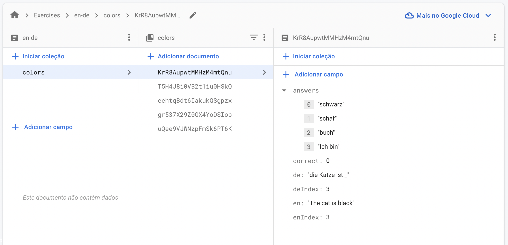

<h1 align="center"> Translate Quizz App </h1>

<p align="center">This project is being created with <b>React Native</b>, <b>Zustand</b>, <b>Typescript</b><br/>

<p align="center">
  <a href="#-technologies">Technologies</a>&nbsp;&nbsp;&nbsp;|&nbsp;&nbsp;&nbsp;
  <a href="#-project">Project</a>&nbsp;&nbsp;&nbsp;|&nbsp;&nbsp;&nbsp;
  <a href="#-execution">Execution</a>&nbsp;&nbsp;&nbsp;|&nbsp;&nbsp;&nbsp;
  <a href="#-demo">Demo</a>&nbsp;&nbsp;&nbsp;&nbsp;&nbsp;&nbsp;

</p>

<br>

## 🚀 Technologies

This project was developed using the following technologies and standards:

- [React Native](https://reactnative.dev/)
- [Typescript](https://www.typescriptlang.org/)
- [Zustand](https://github.com/pmndrs/zustand)
- [Styled Components](https://styled-components.com/)

## 💻 Project

A project to show code organization and architecture of a react native project, using firebase as Backend

## ⚙️ Execution

Install dependencies and run on Android
```sh
yarn && yarn android
```

Install dependencies and run on iOS
```sh
yarn && yarn ios
```

## Backend (Firebae)

<p align="center">
  
</p>

### Architecture:

A collection of **Exercises** have **en-d**e -> **Exercise List[]**

Exercise is an object that has the following properties:

```js
declare type Exercise = {
  en: string
  de: string
  enIndex: number
  deIndex: number
  correct: number
  answers: string[]
}
```

### Properties and reasons to use them:

**en**: string in English

**de**: string in German

**enIndex**: word index with string highlighting in English

**deIndex**: index of the space to fill in the string in German

**answers**: it is an array of options

**correct**: is the index of the correct option

## 🖥 Demo

You  can see a preview here


---
